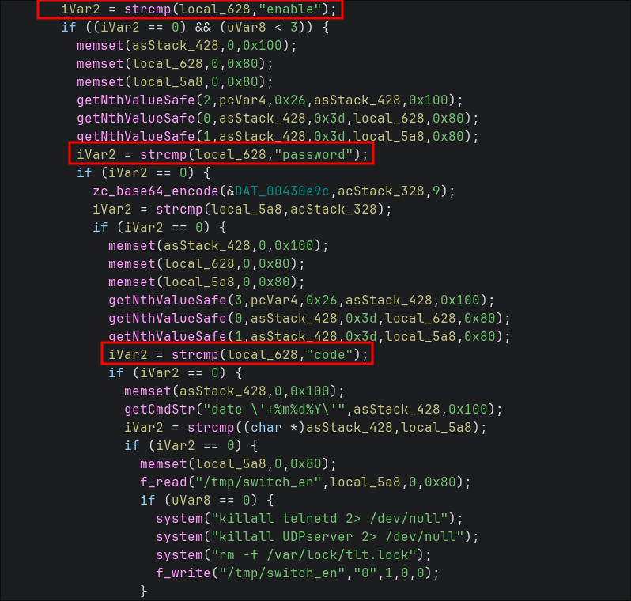
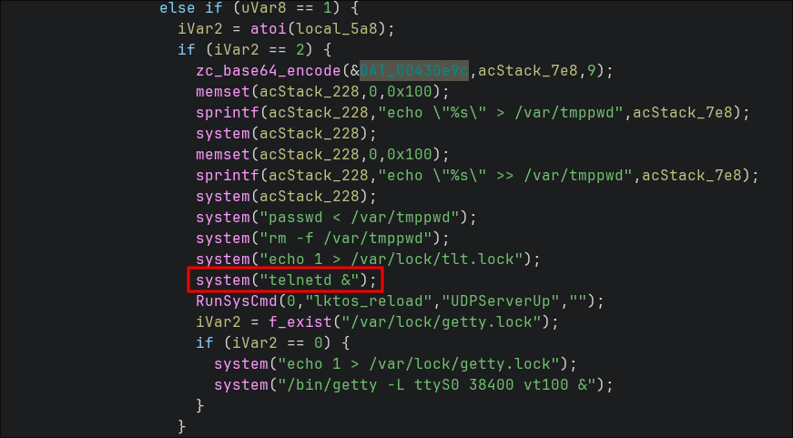
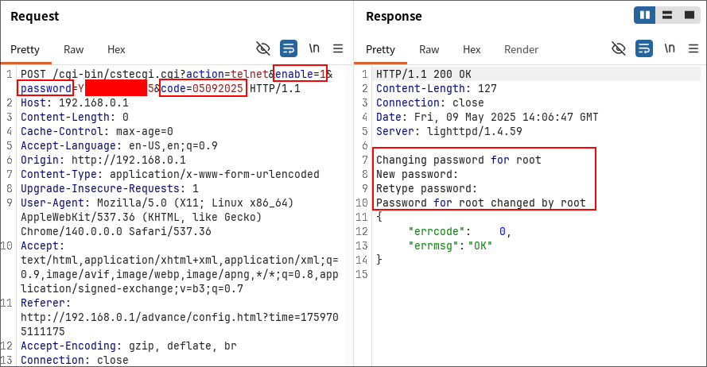
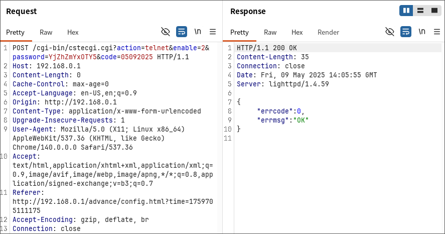
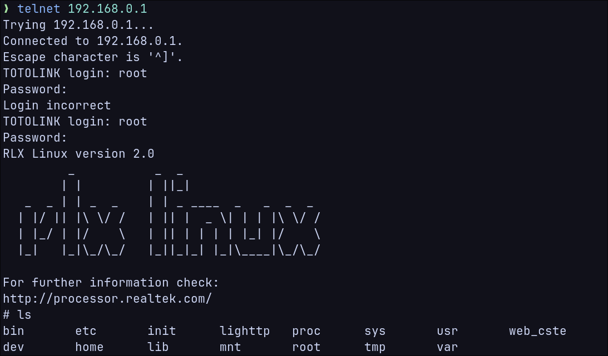

# A720R Telnet backdoor

## Submitter: Nicola Giuffrida

## Information

**Vendor:** TOTOLINK  
**Vendor's website:** [TOTOLINK](https://www.totolink.net/)  
**Model:** A720R  
**Firmware version:** V4.1.5cu.630_B20250509  
**Firmware download address:** [TOTOLINK](https://www.totolink.net/home/menu/detail/menu_listtpl/download/id/203/ids/36.html)

## Severity

CVSS v4.0 Base Score: 8.7 (High)  
Vector: `CVSS:4.0/AV:A/AC:L/AT:N/PR:N/UI:N/VC:H/VI:H/VA:H/SC:N/SI:N/SA:N`

## Vulnerability details

A telnet backdoor can be enabled on the device without authentication by sending two specially crafted requests containing a hardcoded password and a value derived from the current date.

*Note: The required `code` value is derived from the device's current date. If the device is not connected to the Internet and its system date is not synchronized, an attacker may need to brute-force a limited range of possible code values in order to successfully enable the backdoor.*

The vulnerable code is located within the `cstecgi.cgi` firmware binary, where the supplied password and code values are retrieved from the request, validated against the expected values, and, if correct, used to start the telnet service.

After the requests are successfully processed, the device enables the Telnet service. An attacker can then authenticate via Telnet using the same hardcoded password supplied in the requests and obtain a root shell on the device.

As a result, an unauthenticated attacker with network access to the target device can gain full administrative control, leading to complete compromise of the device's confidentiality, integrity, and availability.
